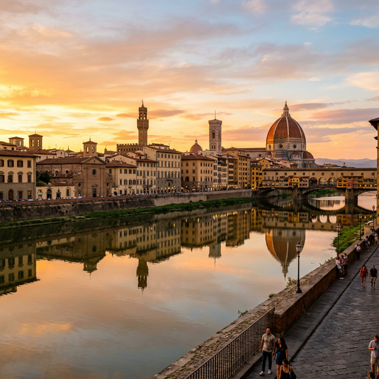
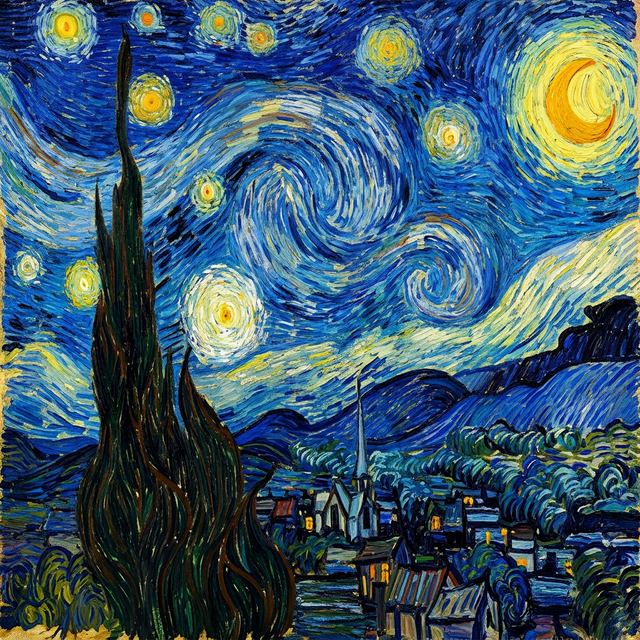

# 🎨 Neural Style Transfer

A deep learning implementation of **Neural Style Transfer (NST)** — blend the content of one image with the artistic style of another to create stunning AI-generated artwork.


---

## 📸 Sample Images

The `samples/` directory contains test images you can use right away:

| Content Image | Style Image |
|:---:|:---:|
|  |  |
| *Scenic cityscape at golden hour* | *Impressionist painting style* |

---

## ✨ Features

- **VGG19-based** feature extraction for content and style representations
- **Gram matrix** computation for capturing artistic style patterns
- Configurable **content/style weight** balance
- Support for **arbitrary image sizes**
- **GPU acceleration** via CUDA for fast processing
- Easy-to-use CLI and modular codebase

---

## 🚀 Quick Start

### 1. Clone the Repository

```bash
git clone https://github.com/hariomThacker751/Neural-Style-Transfer.git
cd Neural-Style-Transfer
```

### 2. Install Dependencies

```bash
pip install -r requirements.txt
```

Or install manually:

```bash
pip install torch torchvision pillow matplotlib numpy
```

### 3. Run Style Transfer

```bash
python style_transfer.py --content samples/content.png --style samples/style.png --output output.png
```

---

## ⚙️ Configuration

| Parameter | Default | Description |
|-----------|---------|-------------|
| `--content` | — | Path to content image |
| `--style` | — | Path to style image |
| `--output` | `output.png` | Path to save result |
| `--epochs` | `300` | Number of optimization steps |
| `--content_weight` | `1` | Weight for content loss |
| `--style_weight` | `1e6` | Weight for style loss |
| `--image_size` | `512` | Output image size |

---

## 🧠 How It Works

Neural Style Transfer uses a pre-trained **VGG19** network to extract features at multiple layers:

1. **Content Representation** — Higher convolutional layers capture the spatial structure
2. **Style Representation** — Gram matrices across multiple layers capture texture and patterns
3. **Optimization** — A generated image is iteratively updated to minimize both content and style losses

```
Content Image ──► VGG19 Features ──┐
                                    ├──► Combined Loss ──► Optimizer ──► Stylized Output
Style Image   ──► Gram Matrices  ──┘
```

---

## 📁 Project Structure

```
Neural-Style-Transfer/
├── README.md
├── samples/
│   ├── content.png       # Sample content image for testing
│   └── style.png         # Sample style image for testing
├── style_transfer.py     # Main style transfer script
├── model.py              # VGG19 feature extractor
├── utils.py              # Image loading/saving utilities
└── requirements.txt      # Python dependencies
```

---

## 📋 Requirements

- Python 3.8+
- PyTorch 2.0+
- torchvision
- Pillow
- matplotlib
- numpy

---

## 🤝 Contributing

Contributions are welcome! Feel free to:

1. Fork the repository
2. Create a feature branch (`git checkout -b feature/amazing-feature`)
3. Commit your changes (`git commit -m 'Add amazing feature'`)
4. Push to the branch (`git push origin feature/amazing-feature`)
5. Open a Pull Request

---

## 📜 License

This project is licensed under the MIT License — see the [LICENSE](LICENSE) file for details.

---

## 🙏 Acknowledgements

- [A Neural Algorithm of Artistic Style](https://arxiv.org/abs/1508.06576) — Gatys et al., 2015
- [PyTorch](https://pytorch.org/) — Deep learning framework
- [VGG19](https://arxiv.org/abs/1409.1556) — Simonyan & Zisserman, 2014

---

<p align="center">Made with ❤️ by <a href="https://github.com/hariomThacker751">Hariom Thacker</a></p>
